<h1 align="center">Urban Studio Website</h1>

[View the live project here.](https://vgopal02.github.io/UrbanStudio/index.html)

This is the main marketing website for a new wellness company called URBAN STUDIO. It has opened a studio which offers- yoga , pilates and meditation in the upmarket suburb of Clapham in London. Clapham is a trendy suburb with young working professionals and older retired people - both of whom the studio hopes to appeal to. Therefore , the site is designed to be accessible on a range of devices , making it easy to navigate for both younger and older potential clients.

<h2 align="center">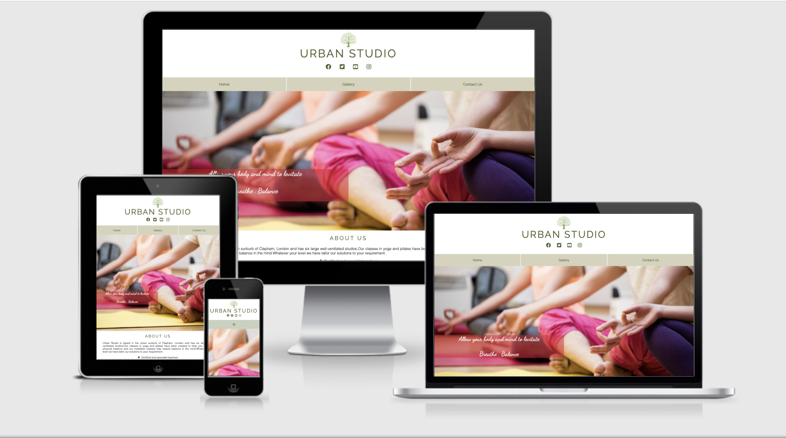</h2>

## User Experience (UX)

-   ## User stories

    -   #### First Time Visitor Goals

        1. As a First Time Visitor, I want to easily understand the main purpose of the site and learn more about the organisation.
        2. As a First Time Visitor, I want to be able to easily navigate throughout the site to find content.
        3. As a First Time Visitor , I want to be able to get a visual feel for the venue.
        4. As a First Time Visitor , I want to be able to contact the organisation to find out more details and join.
       

    -   #### Returning Visitor Goals

        1. As a returning visitor , I want to be able to 
        check the current information about type of classes offered and timetable .
 
 

-   ## Design

    -   #### Color Scheme
       Colors have been inspired by the brand logo ( tree of life) and  color palletes obtained from [colorcombos](https://www.colorcombos.com).
        
        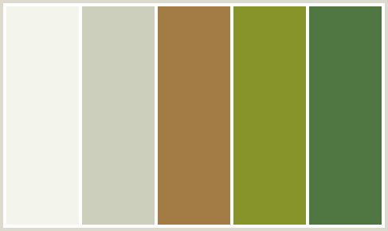
         
        Final Colors used : rgb(75, 94, 42);rgb(214, 210, 188);rgb(202, 209, 190);rgba(221, 6, 53,);rgb(245, 218, 223); rgb(224, 214, 185);

    -   #### Typography
        -   All headers are in Raleway and Josefin font is the main font used throughout the website. Sans Serif is used the fallback font. Both fonts frequently used on websites, are both attractive and reflective of the brand.Dancing Script has been used in the cover text on the hero image with Sans Serif as the fallback font.

    -   #### Imagery
        -   Imagery is important. It wants to reflect the studio as a warm, welcoming and sophisticated environment. The large, background hero image is designed to catch the user's attention. It also has a modern, energetic aesthetic without focussing on any one set of people as the organisation wants to appeal to a varied age-range of persons. This has also been reflected in the gallery page where different age range people can be seen.
     
     

  # Wireframes 

-   ## Site Map
    

    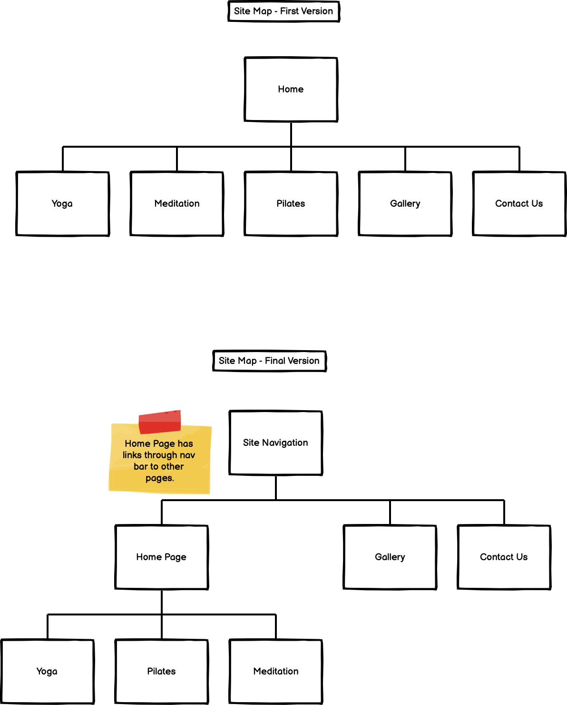

-  ## Home
    

    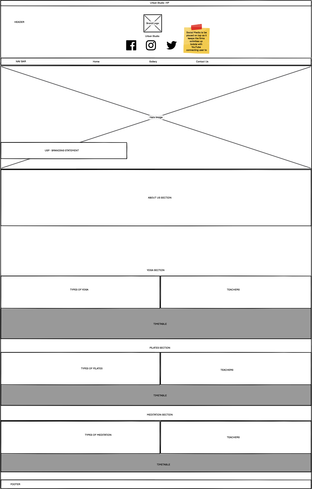&nbsp;&nbsp;&nbsp;&nbsp;&nbsp;
    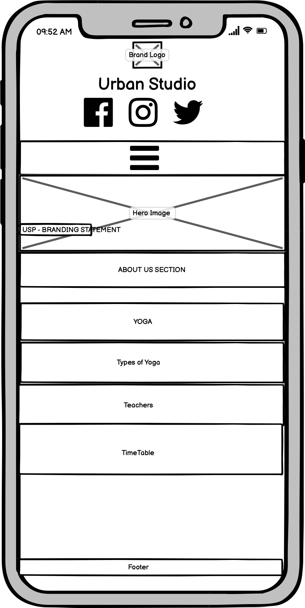
    

-  ## Gallery
    

    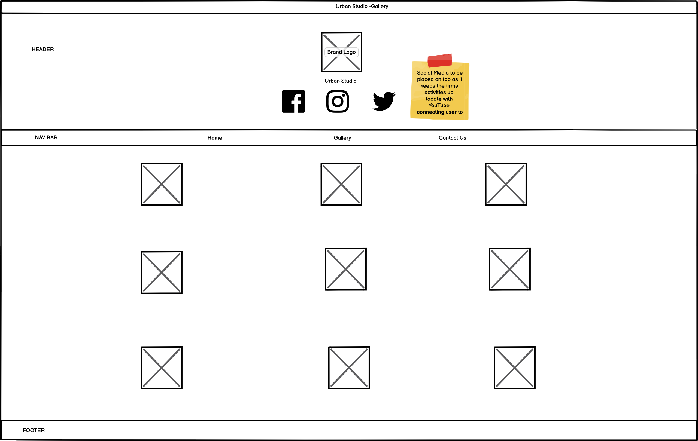&nbsp;&nbsp;&nbsp;&nbsp;&nbsp;
    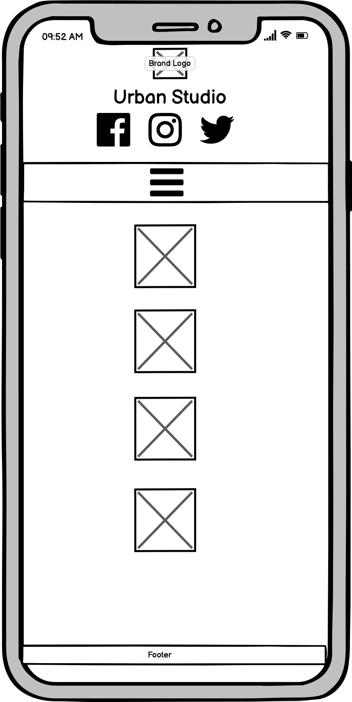
    

-  ## Contact Us
    

    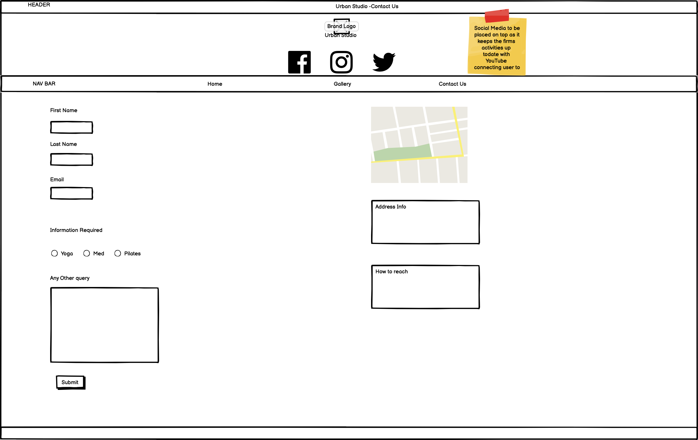&nbsp;&nbsp;&nbsp;&nbsp;&nbsp;
    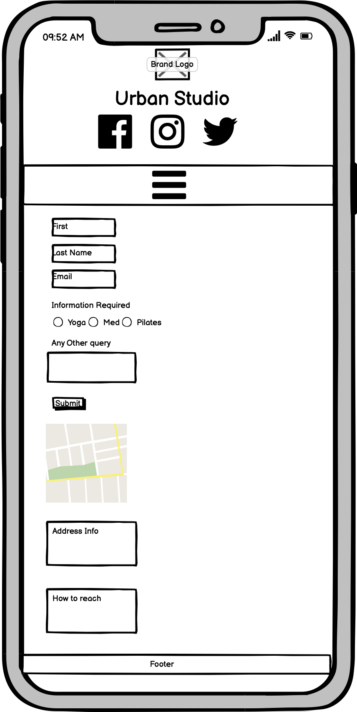
    

 
 

# Features

- ## HOME PAGE
<h2 align="center">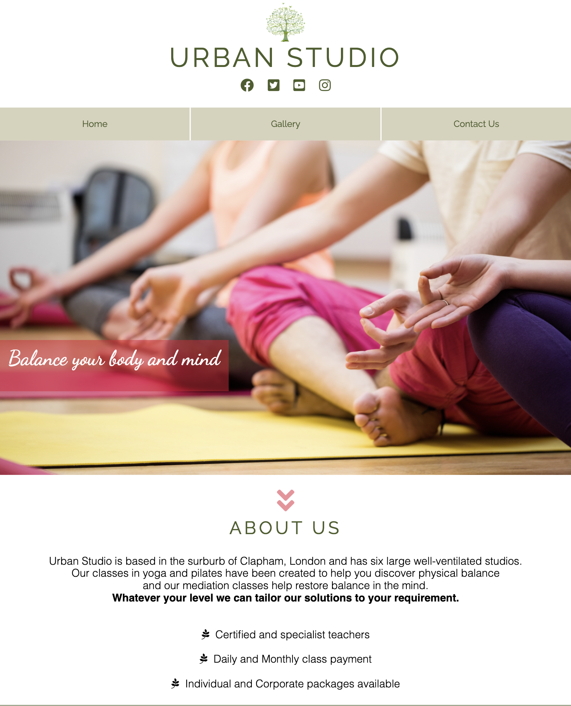</h2>

- Users are automatically greeted into the site with a clean brand logo and social media links.
- This is followed with an easily readable navigation bar to go to the page of their choice. 
- There is a Hero Image with brand text followed by an "About Us Section". 
- Between the "Hero-Image" and "About Us' section there is also a small arrow which indicates to users that there are more details below to which they may directly go .
 
 

- ## Yoga Section
<h2 align="center"></h2>

- In the yoga section, the user is introduced to the core principles of yoga the studio follows.
- This is followed by an easily readable sub-section conveying the different levels and styles offered. 
- Teachers profiles provides the user the level and experience of guidance they are to receive.
 - Following which the user is shown a clear weekday and week-end timetable of the yoga classes.
 
 

- ## Pilates Section
<h2 align="center">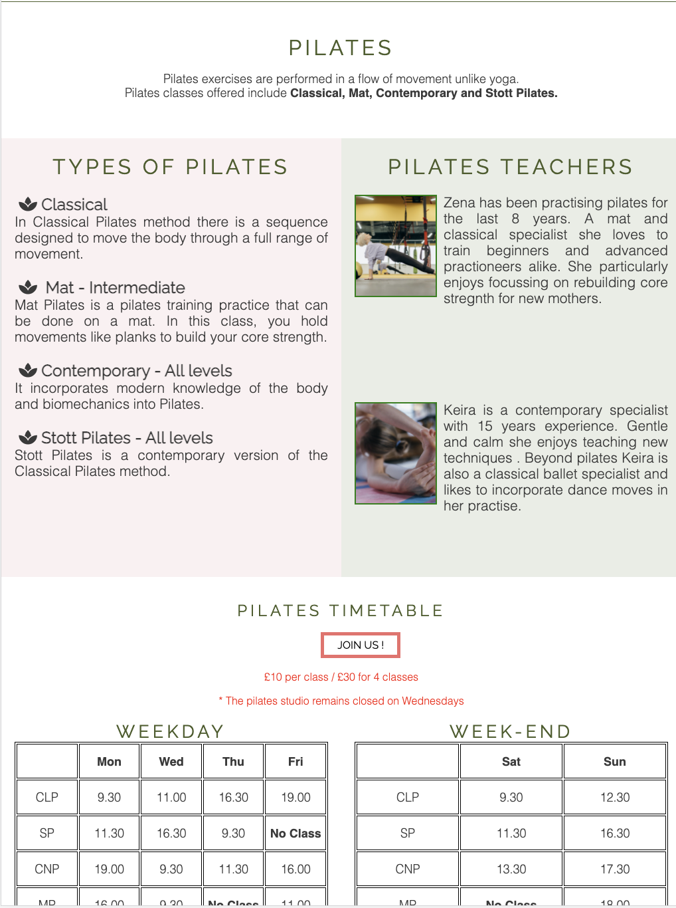</h2>

- In the pilates section the user is introduced to the core principles of pilates the studio follows.
- This is followed by an easily readable sub-section conveying the different levels and styles offered. 
- Teachers profiles provides the user the level and experience of guidance they are to receive.
- Following which the user is shown a clear weekday and week-end timetable of the pilates classes.
 
 

- ## Meditation Section
<h2 align="center">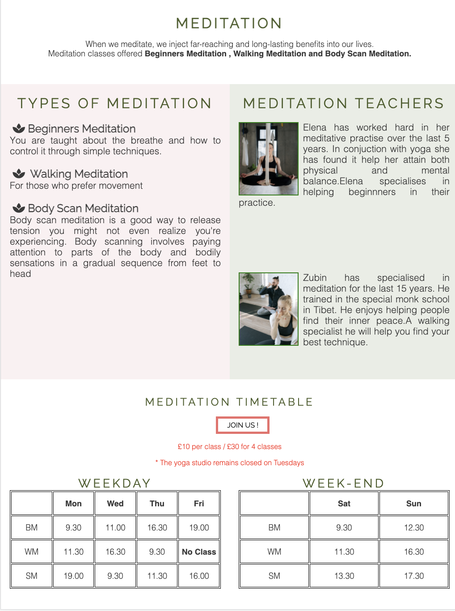</h2>

- In the meditation section the user is introduced to the types of meditation the studio follows.
- This is followed by an easily readable sub-section conveying the different levels and styles offered. 
- Teachers profiles provides the user the level and experience of guidance they are to receive.
- Following which the user is shown a clear weekday and week-end timetable of the meditation classes.
 
 

- ## GALLERY PAGE
<h2 align="center">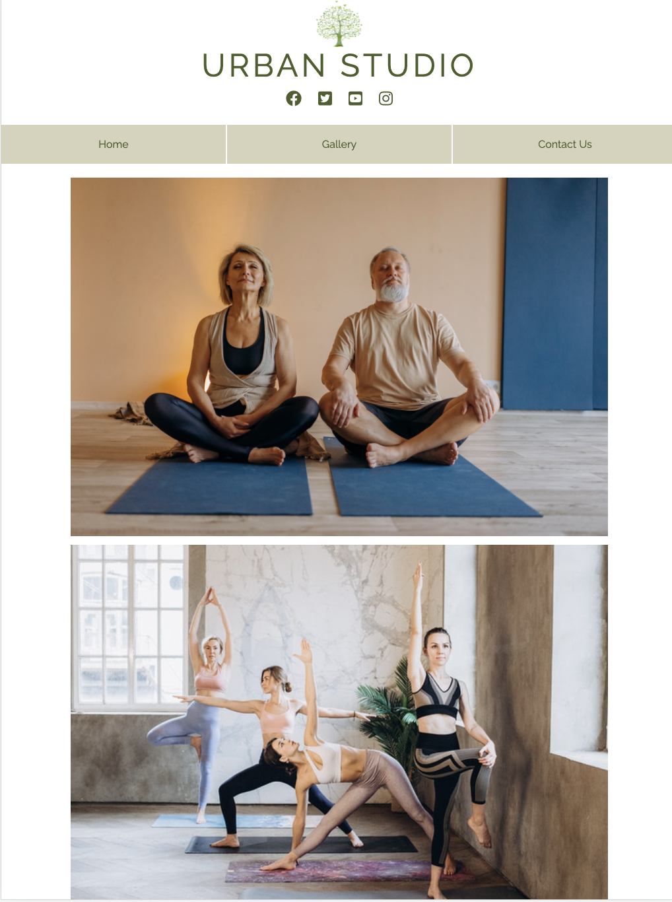</h2>

- The gallery page reflects to the user the studio and its surroundings.
- Using the adage " a picture speaks a thousand words" the gallery page gives the user a virtual experience of how the studio looks and the type of classes taught.
- It indicates to the user of what to expect within the studio surroundings.   
 
 

- ## CONTACT US PAGE
<h2 align="center">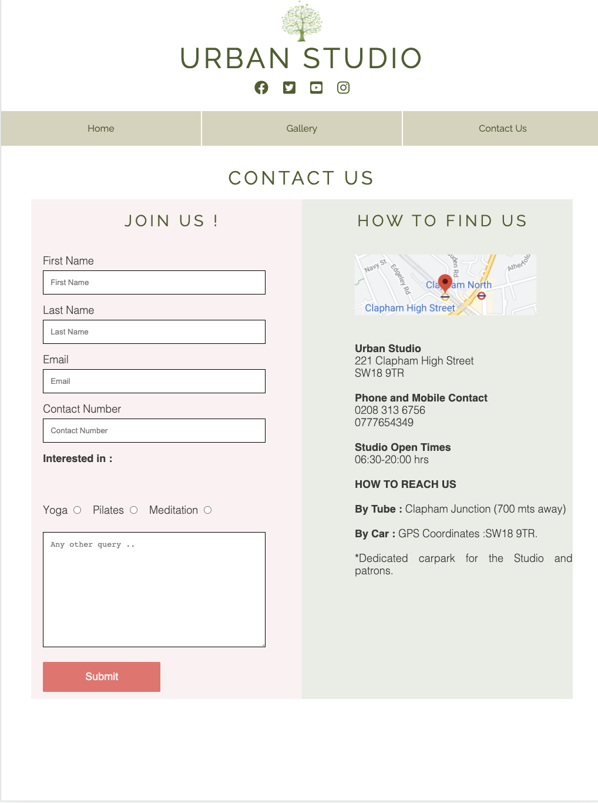</h2>

- The contact us page allows the user to communicate with the studio.
- The page allows the user to send a message to the studio which will be replied to.
- Alternatively, the user has the address and telephone contacts of the studio to be be able to visit or call.    
 
 

 # OTHER KEY FEATURES

- ## Mobile Responsive

        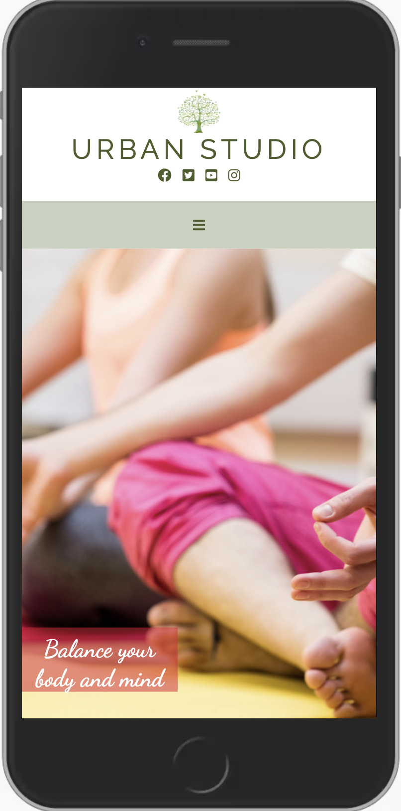&nbsp;&nbsp;&nbsp;&nbsp;&nbsp;&nbsp;&nbsp;&nbsp;&nbsp;&nbsp;
        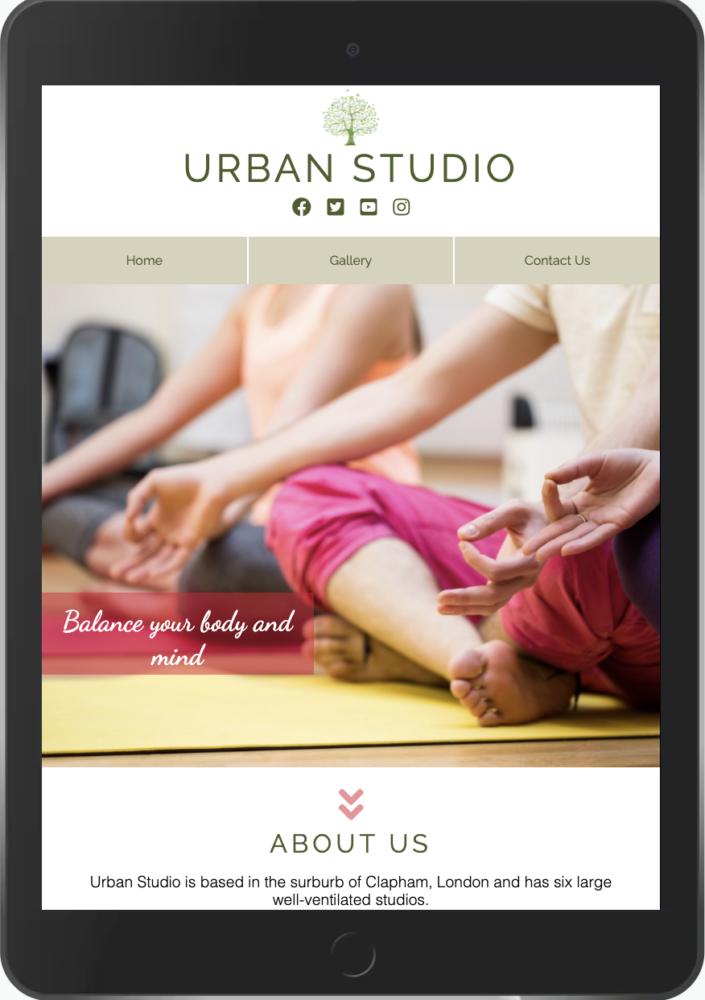&nbsp;&nbsp;&nbsp;&nbsp;&nbsp;&nbsp;&nbsp;&nbsp;&nbsp;&nbsp;
        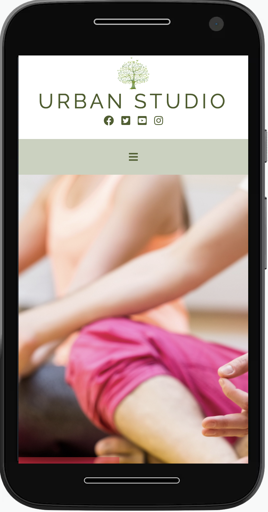
        

-   The site has been made reponsive to different devices with varying widths   .
-   The Nav Bar gets converted to a hamburger menu as a responsive action in screen sizes with width of 600px and below for better user experience.
-   The TYPES and TEACHERS containers in the  Yoga , Pilates and Meditation sections and the Contact Us Page containers becomes a column below 890px as a responsive action.
-   The TIMETABLE containers in the Yoga , Pilates and Meditation sections becomes a column format below 800px as a responsive actionfor better user experience. 
-   The image gallery becomes a column format below 1200px as a responsive action for better user experience.
-   The site is responsive to different browesers - Chrome , Safari and Firefox.

 

 - ## Header and Footer
<h2 align="center">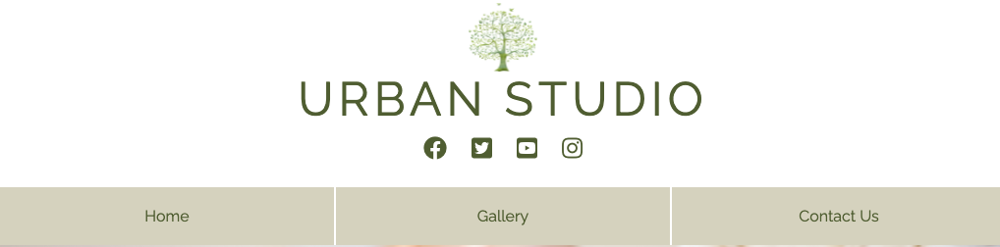</h2>
<h2 align="center">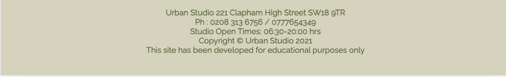</h2>
     

-   The Header and Footer are used consistently in each page so the user knows exactly what to expect and for seemless navigation.
-   They  have a consistent color scheme so the user is clear about the start and end of each page. 
-   The brand words "Urban Studio" on the header returns the user  to home page. 
-   The Nav Bar gets converted to a hamburger menu as a responsive action in screen sizes with width of 600px and below.
 
 

- ## Section Consistency and Section Breaks
    - The home page is divided into three key sections - Yoga , Pilates and Meditation. While information on each section varies user experience remains the same as each section remains consistent with the next.
    - To ensure the user knows that they have come to the end of one section and starting a new one there are clear section line indicating the same.
    - To maintain fluidity of site and ensure the user is not trapped the "Join Us" button in each section allows the user to go to the contact us page without having to scroll back to the top nav bar.
 
 
 
-   ## Color Scheme 
     - The color scheme used has remained consistent through the site . 
     - Limited and consistent use of colors allows the user to know what to expect.
     - Darker color text against lighter backgrounds help the user to read clearly.
     - Font colors include : rgb(75, 94, 42) and Black.
     - Header and Footer background :rgb(214, 210, 188).
     - Yoga,Pilates,Meditation section box background and Contact Us Page:rgb(202, 209, 190,0.4) and rgb(245, 218, 223,0.4).
     - Opacity has been added to ensure the fonts are clearly visible. 
 
 

-   ## Typography
    -   All headers are in Raleway and Josefin font is the main font used throughout the  website with Sans Serif as the fallback font . Both fonts are attractive and reflective of the brand.Dancing Script has been used in the cover text on the hero image. - - Minimum font size used across the site is  16px to ensure all text is clearl and visible based on [The Responsive Website font guidelines](https://learnui.design/blog/mobile-desktop-website-font-size-guidelines.html).
 
 
    
# Technologies Used

### Languages Used

-   [HTML5](https://en.wikipedia.org/wiki/HTML5)
-   [CSS3](https://en.wikipedia.org/wiki/Cascading_Style_Sheets)

### Frameworks, Libraries & Programs Used

1. [Google Fonts:](https://fonts.google.com/)
    - Google fonts were used to import the 'Raleway' , 'Josefin' and 'Dancing Script' fonts into the style.css file which is used throughout the project.
2. [Font Awesome:](https://fontawesome.com/)
    - Font Awesome was used on all pages throughout the website to add icons for aesthetic and UX purposes.
3. [Git](https://git-scm.com/)
    - Git was used for version control by utilizing the Gitpod terminal to commit to Git and Push to GitHub.
4. [GitHub:](https://github.com/)
    - GitHub is used to store the projects code after being pushed from Git.
5. [Balsamiq:](https://balsamiq.com/)
    - Balsamiq was used to create the [wireframes](https://github.com/) during the design process.

# Code Testing and Validation

The W3C Markup Validator and W3C CSS Validator Services were used to validate every page of the project to ensure there were no syntax errors in the project.

-   [W3C Markup HTML Validator](https://validator.w3.org)

<h2 align="center">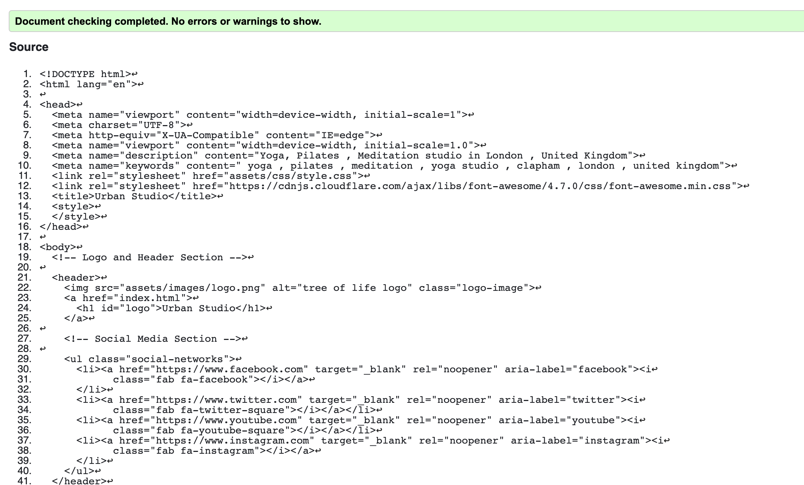</h2>
<h2 align="center">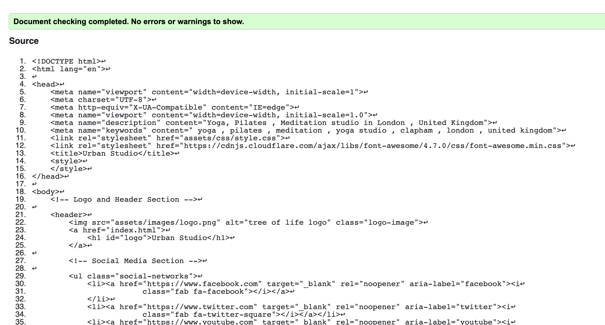</h2>
<h2 align="center">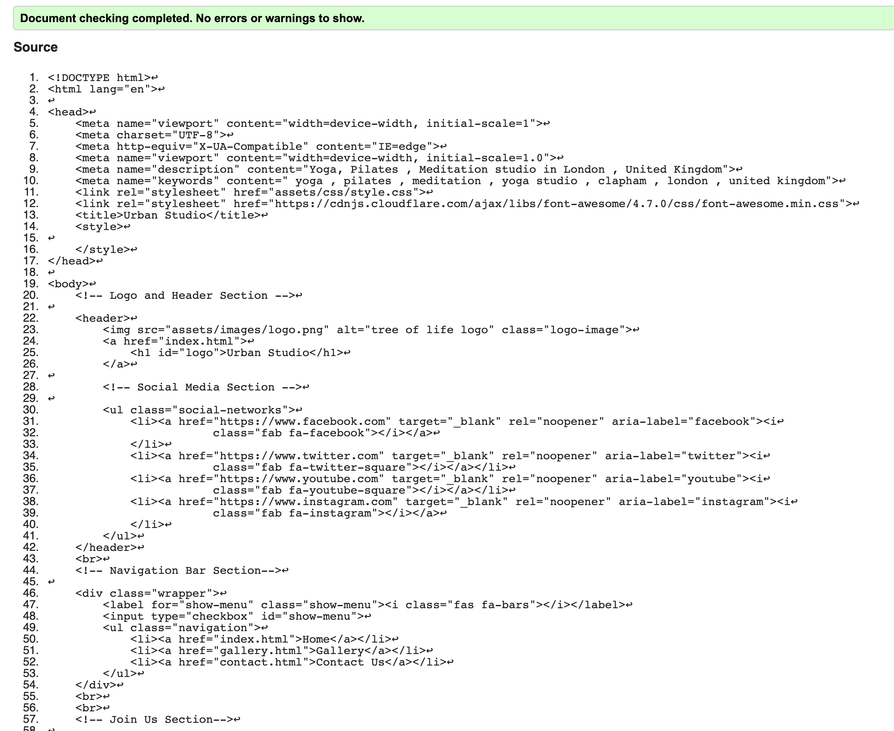</h2>
         

-   [W3C CSS Validator](https://jigsaw.w3.org/css-validator/#validate_by_input) 

    

            

# Testing User Stories from User Experience (UX) Section

-   ### First Time Visitor Goals

    1. As a First Time Visitor, I want to easily understand the main purpose of the site and learn more about the organisation.

        - Upon entering the site, users are automatically greeted with a clean brand logo and social media links. 
        - This is followed by easily readable navigation bar to go to the page of their choice. There is a Hero Image with brand text followed by an "About Us Section".        
        - Between the "Hero-Image" and "About Us' section there is also a small arrow which allows users to understand there is more details below the about-us section to which they may go directly.

    2. As a First Time Visitor, I want to be able to easily be able to navigate throughout the site to find content.

        - The site has been designed to be fluid and never to entrap the user. At the top of each page there is a clean navigation bar, each link describes what the page they will end up at clearly.
        - Within  the home page as users scroll down for more information , there is a "Join Us" link which is the next point of call should they wish to proceed further . This is to ensure the user does not feel entrapped and always has a link to coonect to without having to scroll back upto the navigation bar.
        - On the Contact Us Page, after a form response is submitted, the page refreshes and the user is brought to the top of the page where the navigation bar is.

    3.  As a First Time Visitor , I want to be able to get a visual feel for the venue.

        - The Gallery page allows the user to get a feel for the studio and surroundings.
        - Images have been carefully curated for the user to experience the studio and different age range of people they may come across.

    4. As a First Time Visitor , I want to be able to contact the organisation to find out more details and join.

        - The Contact Us page allows the user to email the studio. Alternatively , the studio's address and phone contacts also allow them to either plan a visit or call the studio.
        - Within  the home page as users scroll down for more information , there is a "Join Us" link which is the next point of call should they wish to proceed further . This is to ensure the user does not feel entrapped and always has a link to coonect to without having to scroll back upto the navigation bar.
 
 

 -   ### Returning Visitor Goals

     1.  As a returning visitor , I want to be able to check the current information about type of classes offered and timetable .

         - The site has been designed to make it easy to add and update information and images as required.
            
         - The site has been made robust enough to add more information without changing the layout. This ensures user experience remains consistent and user knows what to expect eveytime they visit the site. 
 
 

## Further Testing
-   The Website was tested on Google Chrome, Internet Explorer, Microsoft Edge and Safari browsers.
-   The website was viewed on a variety of devices such as Desktop, Laptop, iPhone5, iPhone 6/7/8 & iPhoneX and Android devices.
-   Testing was done to ensure that all pages were linking correctly.
-   Friends and family members  across global locations  were asked to review the site and documentation to point out any bugs and/or user experience issues.
 
 

## Design Challenges
- The time-table section of the yoga , pilates and meditation section proved to be challenging to design especially on mobile devices. To ensure the whole timetable section was responsive on smaller devices the font size needed to be made as small as 8px. However , this goes against good practice as suggested by [The Responsive Website font guidelines](https://learnui.design/blog/mobile-desktop-website-font-size-guidelines.html).

- This was solved by creating two flexboxes instead of a single one and dividing the timetable into weekday and weekend sections. On smaller devices the two flex boxes go into a column format allowing the user to get the information clearly.without having to compromise on the font size.
 
 

## Limitations and Future of the site
- In its current form the site serves the purpose as defined by the organistion - which is to provide and promote to users  information about the organisation's activities .

- Limitations 
    - The lack of technology does not allow the site to be interactive.

- Future

    However, this can be considered as a first step for the organisation. In future with more advanced technology the site can be further developed as:
    - Phase 2 : Adding an interactive time-table and allowing the form to submit information to a database
    - Phase 3 : Adding a backend database allowing users to be able to book  and cancel classes online
    - Phase 4 : Allowing the user to be able to make payment for classes after booking.
 
 

# Deployment

## GitHub Pages

The project was deployed to GitHub Pages using the following steps...
1. Log in to GitHub and locate the [GitHub Repository](https://github.com/)
2. At the top of the Repository (not top of page), locate the "Settings" Button on the menu.
3. Scroll down the Settings page until you locate the "GitHub Pages" Section.
4. Under "Source", click the dropdown called "None" and select "Master Branch".
5. The page will automatically refresh.
6. Scroll back down through the page to locate the now published site [Urban Studio](https://vgopal02.github.io/UrbanStudio/index.html) in the "GitHub Pages" section.
 
 

# Credits

### Code

-   [Arcode Code](https://youtu.be/6RcpEhI7BAw) : For hamburger navigation bar. Code was modified to better fit my needs using only CSS and to create a hamburger menu which centerd itself . Tutorial Found [Here](https://youtu.be/6RcpEhI7BAw)

### Content

-   All content was written by the developer.

-   Colors for the site were chosen based on color properties described [here](http://www.colour-affects.co.uk/psychological-properties-of-colours). The color green was chosen based on the brand USP 'Balance' while supoorting colors were based on the combinations suggested by [colorcombos](https://www.colorcombos.com).

- Font guidelines sought from [The Responsive Website font guidelines](https://learnui.design/blog/mobile-desktop-website-font-size-guidelines.html)

### Media

-   All images were sourced from [Pexels](https://www.pexels.com) and [Unsplash] (https://www.unsplash.com)

- Screen Shots were sourced from [AmIresponsive](ami.responsivedesign) and screenshots through desktop.

### Inspiring Websites:
- [YogaJournal](https://www.yogajournal.com/)
- [YogaHaven](https://www.yogahaven.co.uk/)
- [YogaHub](https://www.yogahub.co.uk/)
- [SchoolsOutChildcare](https://moirahartigan.github.io/Ms1-Schools-Out-Childcare/)
- [Kairosity](https://kairosity.github.io/milestone-project-1-cv-website/#home-section)
- [CaterpillarMontessori](https://constantinadrian.github.io/Caterpillar_Montessori_MS_1/index.html)

### Acknowledgements

-  I would like thank my mentor Medale Oluwafemi. His guidance in giving constructive feedback through all stages of site design and development has been most valuable.
