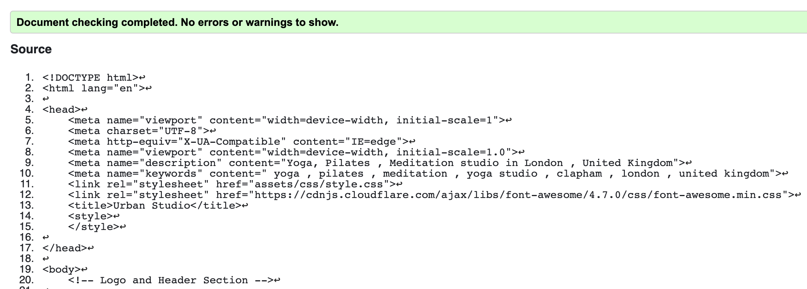

<h1 align="center">Urban Studio Website</h1>

[View the live project here.](https://vgopal02.github.io/UrbanStudio/index.html)

This is the main marketing website for a new wellness company called URBAN STUDIO. It has opened a studio which offers- yoga , pilates and meditation in the upmarket suburb of Clapham in London. Clapham is a trendy suburb with young working professionals and older retired people - both of whom the studio hopes to appeal to. Therefore , the site is designed to be accessible on a range on devices , making it easy to navigate for both younger and older potential clients.

<h2 align="center"></h2>

## User Experience (UX)

-   ### User stories

    -   #### First Time Visitor Goals

        1. As a First Time Visitor, I want to easily understand and learn about the organisation and what it offers.
        2. As a First Time Visitor, I want to be able to easily navigate throughout the site to find content.
        3. As a First Time Visitor , I want to be able to contact the organisation to find out more details and join.

        -   ### Design
    -   #### Colour Scheme
       
Colors were inspired by the brand logo (tree of life - depicting balance which is part of the brand USP) and  color palletes obtained from [colorcombos](https://www.colorcombos.com).

        <h2 align="center"></h2>
         
        
Final Colors used : rgb(75, 94, 42);rgb(214, 210, 188);rgb(202, 209, 190);rgba(221, 6, 53,);rgb(245, 218, 223); rgb(224, 214, 185);

    -   #### Typography
        -   
All headers are in Raleway. Josefin is the main font used throughout the website.Sans Serif is the fallback font in case either fonts are not being imported into the site correctly. Both fonts are frequently used on websites and reflective of the brand image.Dancing Script has been used in the cover text on the hero image with Sans Serif as the fallback font.This has been added to enhance the welcome image while conveying the brand USP.

    -   #### Imagery
        -   
Imagery is very important. It wants to reflect the studio as a warm, welcoming and sophisticated environment. The large, background hero image is designed to catch the user's attention. It also has a modern, energetic aesthetic without focussing on any one set of people as the organisation wants to appeal to a varied age-range of persons. This has also been reflected in image gallery where different age range of people can be seen.

-  ### Wireframes 
    
    -   #### Site Map
        

        

    -  #### Home
        

        &nbsp;&nbsp;&nbsp;&nbsp;&nbsp;
        
        

    -  #### Gallery
        

        &nbsp;&nbsp;&nbsp;&nbsp;&nbsp;
        
        

    -  #### Contact Us
        

        &nbsp;&nbsp;&nbsp;&nbsp;&nbsp;
        
        

## Features

-   Responsive on all device sizes

-   Interactive elements

## Technologies Used

### Languages Used

-   [HTML5](https://en.wikipedia.org/wiki/HTML5)
-   [CSS3](https://en.wikipedia.org/wiki/Cascading_Style_Sheets)

### Frameworks, Libraries & Programs Used

1. [Google Fonts:](https://fonts.google.com/)
    - Google fonts were used to import the 'Raleway' , 'Josefin' and 'Dancing Script' fonts into the style.css file which is used throughout the project.
1. [Font Awesome:](https://fontawesome.com/)
    - Font Awesome was used on all pages throughout the website to add icons for aesthetic and UX purposes.
1. [Git](https://git-scm.com/)
    - Git was used for version control by utilizing the Gitpod terminal to commit to Git and Push to GitHub.
1. [GitHub:](https://github.com/)
    - GitHub is used to store the projects code after being pushed from Git.
1. [Balsamiq:](https://balsamiq.com/)
    - Balsamiq was used to create the [wireframes](https://github.com/) during the design process.

## Testing

The W3C Markup Validator and W3C CSS Validator Services were used to validate every page of the project to ensure there were no syntax errors in the project.

            
### Testing User Stories from User Experience (UX) Section

-   #### First Time Visitor Goals

    1. As a First Time Visitor, I want to easily understand the main purpose of the site - learn more about the organisation and what services it offers.

        1. Upon entering the site, users are automatically greeted with a clean brand logo and social media links. 
      
        2. This is followed by easily readable navigation bar to go to the page of their choice. There is a Hero Image with brand text followed by an "About Us Section". 
        
        3. Between the "Hero-Image" and "About Us' section there is also a small arrow which allows users to understand there is more details below the about-us section to which they may go directly.

    2. As a First Time Visitor, I want to be able to easily be able to navigate throughout the site to find content.

        1. The site has been designed to be fluid and never to entrap the user. At the top of each page there is a clean navigation bar, each link describes what the page they will end up at clearly.

        2. Within  the home page as users scroll down for more information , there is a "Join Us" link which is the next point of call should they wish to proceed further . This is to ensure the user does not feel entrapped and always has a link to coonect to without having to scroll back upto the navigation bar.

        3. On the Contact Us Page, after a form response is submitted, the page refreshes and the user is brought to the top of the page where the navigation bar is.
   
### Further Testing

-   The Website was tested on Google Chrome, Firefox and Safari browsers.
-   The website was viewed on a variety of devices such as Desktop, Laptop, iPhone5, iPhone 6/7/8 & iPhoneX and site has been designed to be responsive on devices with minimum 240px width upto desktop.
-   Testing was done to ensure that all pages were linking correctly.
-   Friends and family members  across global locations ( US, India, Singpore and UK) were asked to review the site and document any bugs and/or user experience issues.

## Deployment

### GitHub Pages

The project was deployed to GitHub Pages using the following steps...

1. Log in to GitHub and locate the [GitHub Repository](https://github.com/)

2. At the top of the Repository (not top of page), locate the "Settings" Button on the menu.

3. Scroll down the Settings page until you locate the "GitHub Pages" Section.

4. Under "Source", click the dropdown called "None" and select "Master Branch".

5. The page will automatically refresh.

6. Scroll back down through the page to locate the now published site [link](https://vgopal02.github.io/UrbanStudio/index.html) in the "GitHub Pages" section.

## Limitations and Future of the site
- In its current form the site serves the purpose as defined by the organistion - which is to provide and promote to users  information about the organisation's activities .

Limitations 
- The lack of technology does not allow the site to be interactive.

Future

However this can be considered as a first step for the organisation. In future with more advanced technology the site can be further developed as:
- Phase 2 : Adding an interactive time-table and allowing the form to submit information to a database

- Phase 3 : Adding a backend database allowing users to be able to book  and cancel classes online

- Phase 4 : Allowing the user to be able to make payment for classes after booking.

# Urban Studio
> A new wellness company called URBAN STUDIO has opened a studio in an upmarket suburb of Clapham in London.

  

## Table of Contents
* [General Info](#general-information)
* [Technologies Used](#technologies-used)
* [UI](#user-interface)
* [UX](#user-experience)
* [Wireframes](#wire-frames)
* [Design](#Site-Design)
* [Setup](#setup)
* [Testing](#Testing-and-Code-Validation)
* [Limitations and Future](#Limitations-and-Future-of-the-site)
* [Acknowledgements](#Acknowledgements)
* [Contact](#contact)

## General Information
-	A new wellness company called URBAN STUDIO has opened a studio in an upmarket suburb of Clapham in London.
-	OBJECTIVE OF SITE : Information based site to promote the activities of the studio -Yoga , Pilates , Meditation- to encourage more clients to join.
-	TYPE OF SITE - B2C
- AUDIENCE - Clapham is a trendy suburb with young working professionals and older retired people - both of whom the studio hopes to appeal to. 
-	WEBSITE CONTENT: Types of Classes , Class TimeTables , Visual Image Gallery and Contact Us section for user to be able to show more interest or ask any specific query.

## Technologies Used
- HTML 
- CSS

## User Interface 
As the site is static and keeping in mind the objective of the project (which is for site to provide and promote information to potential clients about the studio and activities) the site has been structured into 3 main pages:

#### HOME PAGE
- The user or potential client is introduced to the brand with a welcoming image and brand message .
- About Us : describes the studio in brief . The aim is to provide the information and key points without making it too wordy.
- Yoga : This provides the user with teaching styles , teachers ,timetable and cost of class.
- Pilates:This provides the user with teaching styles , teachers ,timetable and cost of class.
- Mediation:This provides the user with teaching styles , teachers ,timetable and cost of class.

#### GALLERY
- Provides a visual image of the studio and people in training to allow users to get a feel for the studio.

#### CONTACT US

- Form to contact the studio to proceed futher and studio address information .

#### OTHER KEY FEATURES

##### BRAND IMAGE and LOGO 
- Well positioned at top of the screen so the user can capture it in as a first impression

##### HEADER /NAV BAR / FOOTER

- These remain same through the site for consistent user experience.

##### SOCIAL MEDIA
- As the site is static at this point ensuring potential clients have access to all promotional information is vital. Therefore, the social media has been placed at the very top with the 
brand logo so it cannot be missed.

##### RESPONSIVE SITE 

- The site has been designed to have the same visual appeal on both large screen (desktop/laptop) and smaller (mobile screens).

## User Experience 

- URBAN STUDIO uses the website to appeal to the user as a WARM, TRENDY AND SOPHISTICATED environment

- BRAND USP: Balance. Breathe  - Well advertised as text on image so the user does not miss it.

- ONE CLICK AWAY : The site has a simple nav bar on each page which allows the user to navigate the whole site . Within the home page there are consistent links to relevant page(s) like
contact us so user does not need to scroll back up the page . 

#### Visual appeal 
 One of the most important factors of UX . Visual appeal is based on combination of the following:

- Images : The site classy images to promote the studio as a warm and welcoming yet trendy studio.All images were sourced from https://www.pexels.com and https://www.unsplash.com
- Fonts  : The fonts have been chosen to reflect a smart , professional organisation yet not corporate in nature. Raleway ( Headers) Josefin ( Body) Dancing Script - https://fonts.google.com/
- Colors : Colors were inspired by the brand logo ( tree of life) and  color palletes obtained from https://www.colorcombos.com

 
 Final Colors used : rgb(75, 94, 42);rgb(214, 210, 188);rgb(202, 209, 190);rgba(221, 6, 53,);rgb(245, 218, 223); rgb(224, 214, 185);

#### Responsive Site 
From the onset the site was designed to be mobile responsive as most users were more likely to use smaller devices to find information about the studio. 

- The nav bar was redesigned to fit the small screen as a hamburger menu. Code for this was inspired by ou Tube Video by Arcode code.
- The image gallery and contact us section was redesinged to fit the smaller screen in a single column .

## Wire Frames 

All wireframes were created using Balsamiq
 
 
Site Map
 
 

 
 
Home Page - Full Screen & Mobile Responsive
 
 

  &nbsp;&nbsp;&nbsp;&nbsp;&nbsp;
  

 
Gallery Page
 
 

  &nbsp;&nbsp;&nbsp;&nbsp;&nbsp;
  

 
Contact Us
 
 

  &nbsp;&nbsp;&nbsp;&nbsp;&nbsp;
  

## Site Design
The site has been designed keeping immediate future growth in mind - which is to add more information content.

- A consistent header / footer approach makes it easy for the end user to be able to maintain information only without changing the layout.
- The nav bar is robust enough to add more elements as the site grows without having to change design.
- Site may be self-managed if only basic content and images need to be changed . In such a situation the client will have to be trained.

## Setup
The site was developed using gitpod and hosted on github.

## Testing and Code Validation

### HTML Code 
- It was validated using W3C MarkUp Validation service by direct input. 
- There were 2 warnings indicated in Nav Bar and Hero Image section

"Section lacks heading. Consider using h2-h6 elements to add identifying headings to all sections."

- Both were resolved.

### CSS Code 
- The code was found to be clean.

    

### Site Testing

- The site was tested over different browsers ( eg : Chrome , Safari).
- The site was also tested over multiple global locations as download speeds vary and while it may not be necessary for the curent site  which is small, it is good practise as the site evolves and grows.

## Limitations and Future of the site
- In its current form the site serves the purpose as defined by the organistion - which is to provide and promote to users  information about the organisation's activities .

Limitations 
- The lack of technology does not allow the site to be interactive.

Future

However this can be considered as a first step for the organisation. In future with more advanced technology the site can be further developed as:
- Phase 2 : Adding an interactive time-table and allowing the form to submit information to a database
- Phase 3 : Adding a backend database allowing users to be able to book  and cancel classes online
- Phase 4 : Allowing the user to be able to make payment for classes after booking.

## Acknowledgements

### Inspiring Websites:
- https://www.yogajournal.com/
- https://www.yogahaven.co.uk/
- https://www.yogahub.co.uk/
- https://moirahartigan.github.io/Ms1-Schools-Out-Childcare/
- https://kairosity.github.io/milestone-project-1-cv-website/#home-section
- https://constantinadrian.github.io/Caterpillar_Montessori_MS_1/index.html

### Wire Frames 
-The project started with a simple hand sketched wireframe. 

-The final site map and wireframes were created using Balsamiq

### Coding
- Hamburger Nav Bar : 
   You Tube Video by Arcode code - Hamburger Type Responsive Menu Navigation Only HTML and CSS Tutorial

- W3C Schools website : For extra HTML /CSS guidance

### Visual Appeal
- Brand Logo : Tree of life - google images

- Fonts : Google Fonts 

- Images: All images were sourced from https://www.pexels.com and https://www.unsplash.com

- Fontawesome : for all font images

- Screen Shots : http://ami.responsivedesign.is/

- Color Scheme : http://www.colorcombos.com

### Code Validation

- HTML Validation: https://validator.w3.org/
- CSS Validation :https://jigsaw.w3.org/

### Mentor Guidance
- I would like thank my mentor Medale Oluwafemi for his valuable time and guidance in giving constructive feedback to further improve the site and its features through all stages of site design and devlopment.

## Contact
- Created by [Vidya Rajeev](vgopal02@yahoo.com) - feel free to contact me!

